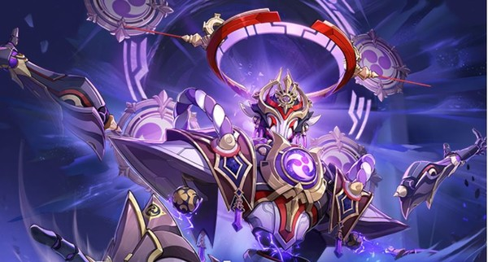

<h2 title="hehehe"> 안녕하세요👋, 저는 이병찬이라고 합니다!</h2>
 
  

***저는 이런 사람입니다!***

- 👨🏽‍💻 서강대학교 게임&평생 교육원을 졸업했습니다.
- 🌱 지금은 2D 게임을 주로 기획 및 설계 하고 있으며, 흥미롭고 매력적인 게임을 만드는 것을 목표로 하고 있습니다.
- 💬 "인간은 패배하기 위해 태어나지 않았어. 인간은 파괴될 수 있지만 패배할 수는 없어. - 어네스트 헤밍웨이" 와 같은 인간 찬가를 다루는 이야기를 만들고 싶습니다.
- 📫 제 이메일은 [aedws98@gmail.com](mailto:aedws98@gmail.com) 입니다.
 
 
 

-----

 **현재 개발중인 프로젝트 :**

[LootShooter_2025_2D](https://github.com/aedws/LootShooter_2025_2D)
- 2D 런앤건 루트슈터 : 커서AI 활용 숙련도 상승을 목표로 1개의 완성된 게임을 제작

- [개발 현황 구경하기](https://github.com/aedws/LootShooter_2025_2D/commits/master)
- 사용 리소스 에셋 : [정리 완료 시 추가될 예정입니다.]()

-----
 **개발 완료한 프로젝트 :**

[달의 파편](https://drive.google.com/file/d/1_F57CeFbwKo_CsG3QpBL20tzLBatSu4G/view?usp=sharing)
- 2D 미소녀 수집형 게임 [메인 총괄 기획]

- 프로그래머 : [조래현](https://github.com/project-narh)

[Stella Forest](https://drive.google.com/file/d/17hvFrx4CyN_hIBPPRNo11NH3e97FaOR9/view?usp=drive_link)
- 2D 액션 플랫포머 게임 [메인 총괄 기획]

- 프로그래머 : [임창범](https://github.com/ckdqja581592)  
- 아트 디렉터 & 캐릭터 일러스트 & 애니메이션 : [이영서](https://x.com/Takashi__0710?t=0UlmOuHtDp466KzLUVoijA&s=09)

- UI 디자이너 : [홍정기](https://www.pixiv.net/users/22775264)   

-----
 

**문서 사용 시 자주 사용하는 도구 :** 

<code></code> PPT <code></code> Excel
<code></code> Word
<code></code> 한글

**읽을 수 있는, 사용은 가능한 프로그래밍 언어 :**   <code></code> C
 <code></code> C#  

-----
## **자주 플레이 한 게임 목록** 

  - [원신](https://genshin.hoyoverse.com/ko/home) :
  전투 디자인적인 흥미를 위주로 플레이 하고 있습니다.

  - [벽람항로](https://azurlane.xdg.com/) : 미소녀만 구성되어 있는 수집형 게임의 매력을 좋아하여 플레이 하고 있습니다.

  - [블루 아카이브](https://www.nexongames.co.kr/game/blue_archive.php) : 깊이 있는 이야기의 서사를 좋아하여 플레이 했습니다.

  - [소녀전선](https://www.girlsfrontline.co.kr/) : 캐릭터를 활용하여 전술적 의미를 만드는 게임 디자인을 좋아하여 플레이 했습니다.

  - [명조 : 웨더링웨이브](https://wutheringwaves.kurogames-ads.com/download/?lang=kr&page_id=U0xDwv6dod&&utm_source=pc_googleadwords_int&utm_campaign=search&campaignid=22654876749&adgroupid=183832602154&keyword=%EB%AA%85%EC%A1%B0&device=c&ad_id=757529604959&channel=g&gad_source=1&gad_campaignid=22654876749) : 3D 전투의 조작감과 기동성, 다양한 성장 방식 및 이를 어디까지 제한하는지에 대한 부분에 흥미가 있어 플레이 하고 있습니다.

  - [소녀전선2](https://gf2.haoplay.com/kr/pcweb/?fuid=ggkrsearch&gad_source=1&gad_campaignid=21822428789) : 엑스컴류의 게임을 처음 접해봤고, 학습 복잡도가 게임에 미치는 영향을 확인하고자, 동시에 후속작에 대한 관심으로 플레이 하고 있습니다.

  - [던전앤파이터](https://df.nexon.com/) : 헬파밍 시즌이 돌아왔습니다! 저는 해당 파밍 방식을 흥미롭게 생각하고, 실제로 좋게 생각하고 있습니다. 물론, 장점만 존재하지는 않다고 생각하고 있습니다.

  - [이터널리턴](https://playeternalreturn.com/main?hl=ko-KR) : 쿼터뷰 배틀로얄이라는 관점에서, 매우 신선하다고 생각하여 플레이 하고 있습니다.

 

## **이런 연출을 좋아하고, 만들고 싶습니다.**

**Blue Archive**  
- 1부 최종편 PV
  

**Genshin Impact**
- 3.2 ver PV  
    

- Nahida PV  
  

-----
 

**최종 갱신 일자 : 2025.07.04**
- 수정사항 : 개발중인 프로젝트 및 개발 목적 기재, 게임 목록 추가 반영